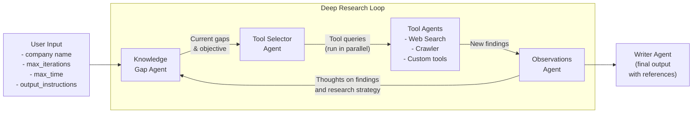
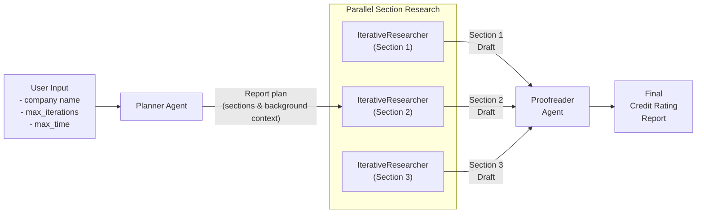

# Deep Credit Rating Analysis using the OpenAI Agents SDK

An agentic credit rating system leveraging the [OpenAI Agents SDK](https://github.com/openai/openai-agents-python) to conduct thorough credit assessments of companies using publicly available information.

The system employs a multi-agent architecture that operates iteratively, progressively enhancing its understanding of a company's credit profile and generating detailed insights that contribute to the final credit rating report.

Built with extensibility in mind, it supports custom tools and third-party LLMs that conform to the OpenAI API specification. When utilizing OpenAI models, all LLM interactions and tool calls are fully traceable.

## Overview

The system offers two operational modes:

- `IterativeResearcher`: Conducts continuous analysis of a company's credit profile and generates rating reports
  - Ideal for concise reports (up to 5 pages / 1,000 words)
  - Allows customization of research depth, time constraints, report length, and formatting preferences
- `DeepResearcher`: Executes a comprehensive, structured analysis process, beginning with report outline creation and running multiple parallel `IterativeResearcher` instances for each section
  - Suitable for extensive reports (20+ pages)

The `DeepResearcher` workflow follows this sequence:

1. Receives a company name and performs initial research to develop a credit rating report structure
2. For each section of the report outline, launches parallel `IterativeResearcher` instances that:
   1. Detect knowledge gaps in current research
   2. Strategically choose appropriate tools to address gaps
   3. Execute research actions via specialized agents
   4. Compile findings into comprehensive sections
3. Combines all sections into a cohesive, well-structured credit rating report

The system operates autonomously without requiring initial clarification queries.

## Flow Diagram

### IterativeResearcher Flow



### DeepResearcher Flow



## Installation

Configure your environment:

```sh
cp .env.example .env
```

Edit the `.env` file with your API credentials:

```sh
OPENAI_API_KEY=<your_key>
SEARCH_PROVIDER=serper  # or set to openai
SERPER_API_KEY=<your_key>
```

## Usage

### Python Module

```python
# See the /examples folder for working examples
import asyncio
from deep_researcher import IterativeResearcher, DeepResearcher

# Execute IterativeResearcher for basic analysis
researcher = IterativeResearcher(max_iterations=5, max_time_minutes=5)
company = "Apple Inc."
report = asyncio.run(
    researcher.run(company, output_length="5 pages")
)

# Execute DeepResearcher for comprehensive analysis
researcher = DeepResearcher(max_iterations=3, max_time_minutes=5)
report = asyncio.run(
    researcher.run(company)
)

print(report)
```

## System Architecture

The Deep Credit Rating System comprises the following elements:

### Core Components

- **IterativeResearcher**: Manages iterative analysis of company credit profiles
- **DeepResearcher**: Coordinates comprehensive analysis including outline creation, parallel research execution, and final review
- **LLM Client**: Handles language model interactions with support for model substitution

### Agent System

- **Knowledge Gap Agent**: Evaluates research progress and identifies information gaps
- **Tool Selector Agent**: Determines optimal tools for addressing specific gaps
- **Tool Agents**: Specialized agents for research execution (extensible):
  - Web Search Agent
  - Website Crawler Agent
- **Writer Agent**: Compiles research findings into structured credit rating reports

### Research Tools

- **Web Search**: Performs SERP queries for information gathering
  - Default implementation uses [Serper](https://www.serper.dev) for Google searches (requires `SERPER_API_KEY`)
  - Alternative: Set `SEARCH_PROVIDER=openai` to use OpenAI's native search
- **Website Crawler**: Extracts detailed content from specified websites

### Custom Tool Agent Implementation

To add custom tool agents:
1. Create tools in `app/tools`
2. Develop tool agent in `app/agents/tool_agents`
3. Register agent in `app/agents/tool_agents/__init__.py`
4. Update `app/agents/tool_selector_agent.py` system prompt

### LLM Configuration

Supports any LLM conforming to OpenAI API specifications, including DeepSeek and OpenRouter models. Requires compatibility with [Structured Outputs](https://platform.openai.com/docs/guides/structured-outputs).

LLM configuration is managed in `app/llm_client.py`

## Trace Monitoring

When using OpenAI models, the system integrates with OpenAI's trace monitoring, generating trace IDs for real-time workflow and agent interaction monitoring.